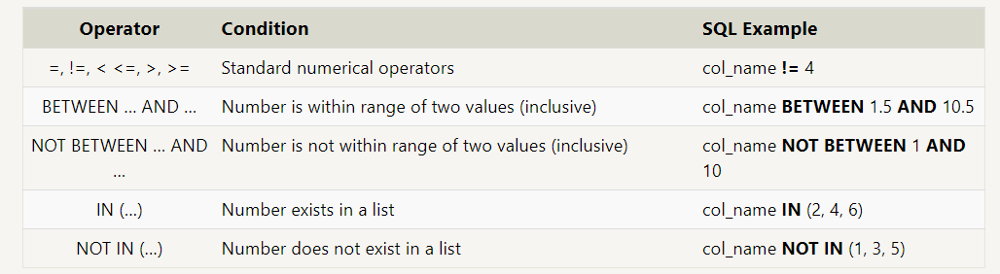
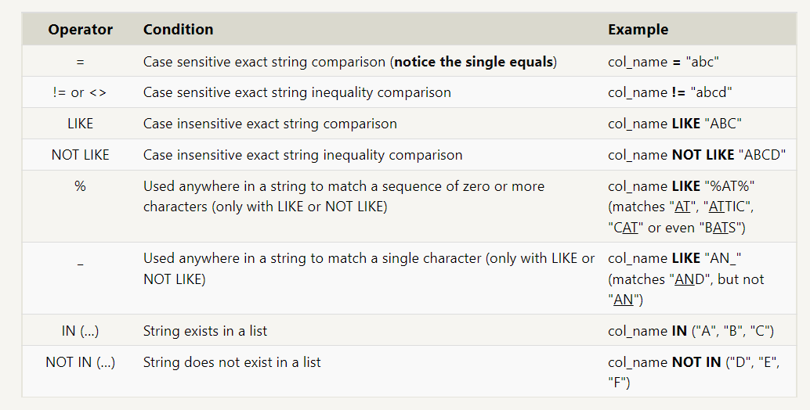

# sql
## What is SQL database
Structured Query Language, is a language designed to allow both technical and non-technical users query, manipulate, and transform data from a relational database.

## Lesson 1 : SELECT queries 101

 ***Select spicific column/s from mytable***  
<pre>SELECT column, another_column, …etc
FROM mytable;</pre> 
 

 ***Select all columns from mytable***  
<pre>SELECT *
FROM mytable;  </pre> 

## Lesson 2 : Queries with constraints (Pt. 1)

***Select query with constraints***
<pre>SELECT column, another_column, …
FROM mytable
WHERE condition
    AND/OR another_condition
    AND/OR …;</pre>

## Lesson 3 : Queries with constraints (Pt. 2)

## Lesson 4 : Filtering and sorting Query results
DISTINCT keyword will blindly remove duplicate rows.
<pre>SELECT DISTINCT column, another_column, …
FROM mytable
WHERE condition(s);</pre>

<pre>SELECT column, another_column, …
FROM mytable
WHERE condition(s)
ORDER BY column ASC/DESC
LIMIT num_limit OFFSET num_offset;</pre>

## Lesson 5 : Simple SELECT Queries (review)

## Lesson 6 : Multi-table queries with JOINs
<pre>SELECT column, another_table_column, …
FROM mytable
INNER JOIN another_table 
    ON mytable.id = another_table.id
WHERE condition(s)
ORDER BY column, … ASC/DESC
LIMIT num_limit OFFSET num_offset;</pre>

## Lesson 7: OUTER JOINs
<pre>SELECT column, another_column, …
FROM mytable
INNER/LEFT/RIGHT/FULL JOIN another_table 
    ON mytable.id = another_table.matching_id
WHERE condition(s)
ORDER BY column, … ASC/DESC
LIMIT num_limit OFFSET num_offset;</pre>

## Lesson 8: A short note on NULLs 

<pre>SELECT column, another_column, …
FROM mytable
WHERE column IS/IS NOT NULL
AND/OR another_condition
AND/OR …;</pre>

## Lesson 9: Queries with expressions

<pre> SELECT column AS better_column_name, …
FROM a_long_widgets_table_name AS mywidgets
INNER JOIN widget_sales
  ON mywidgets.id = widget_sales.widget_id; </pre>

## Lesson 10: 